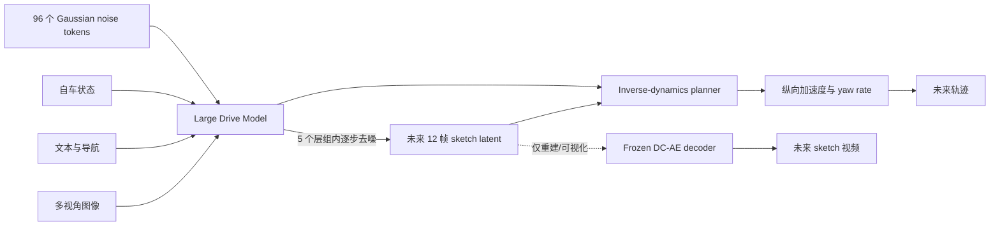
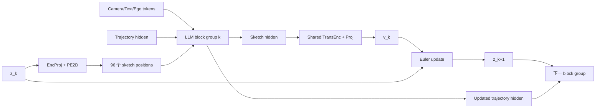

# X-Mind 深度解读

> [!abstract]
> X-Mind 将 Predictive World Model 作为 VLA 内部的 Visual Chain-of-Thought。它不生成高成本 RGB 视频，而是生成包含车辆、道路拓扑、交通灯、导航意图和速度法规信息的未来 BEV sketch。一个 domain-specific DC-AE 将完整 12 帧未来压缩为 96 个 latent tokens；Recurrent Block Diffusion 再把 5 次 flow-matching 去噪映射到 LLM 的 5 个层组中，使未来生成与轨迹规划在一次 backbone forward 内完成。

## 1. 论文信息

- **Title**: X-Mind: Efficient Visual Chain-of-Thought via Predictive World Model for End-to-End Driving
- **Organization**: PWM Team, XPeng Inc.
- **Version**: arXiv:2606.28758v1, 2026-06-27
- **Project**: [https://x-mind.github.io](https://x-mind.github.io)
- **Local PDF**: `C:\Users\huawei\Zotero\storage\R38A5DNZ\Zhao et al. - 2026 - X-Mind Efficient Visual Chain-of-Thought via Predictive World Model for End-to-End Driving.pdf`

## 2. 要解决的问题

普通端到端驾驶策略学习：

$$
\hat\tau=\pi_\theta(o_t,r_t,s_t),
$$

其中 $o_t$ 是当前视觉观察，$r_t$ 是导航/文本条件，$s_t$ 是自车状态。这种做法可以通过数据关联直接拟合轨迹，但没有被强制学习：

$$
\text{当前世界如何演化}
\quad\text{以及}\quad
\text{规划动作将面对什么未来}.
$$

传统改进有两个问题：

1. **串联式世界模型**：先完整生成未来视频，再运行 planner，车端延迟太高；
2. **末端辅助任务**：只在 backbone 最后追加未来重建头，世界模型监督对深层 LLM 的约束较弱，planner 仍可能学习 shortcut。

X-Mind 的回答是：把未来 latent 放进 LLM 中间层的计算过程，让“预测未来”成为产生动作之前必须经过的内部状态。

## 3. 总体架构



统一写成：

$$
x=(I^{1:7},q,s),
$$

$$
\hat z_{1:12}=G_\theta(x,\epsilon),
$$

$$
(\hat a_{\mathrm{lon}},\hat\omega_{\mathrm{yaw}})
=P_\phi(H_\theta,\hat z_{1:12}),
$$

$$
\hat\tau=\operatorname{KinematicIntegrate}
(\hat a_{\mathrm{lon}},\hat\omega_{\mathrm{yaw}}).
$$

这里 $G$ 不是独立的外部视频生成器，而是嵌在 Large Drive Model 各个层组中的 latent flow。

## 4. Abstract Sketch 到底是什么

它是一段未来结构化 BEV 视频，不是 RGB 视频，也不是单纯 occupancy map。

### 4.1 物理环境层

- 自车；
- 周围动态车辆；
- 车道线、道路边界与拓扑连接；
- 障碍物占用和多车相互关系。

### 4.2 驾驶先验层

- 动态交通灯状态；
- 宏观导航区域；
- 路径方向箭头；
- 当前速度；
- 距离限速的剩余余量；
- 超速量。

所以它更准确地说是：

$$
B_t=operatorname{Rasterize}
(\text{geometry},\text{agents},\text{signals},
\text{route},\text{rules},\text{ego status}).
$$

> [!important]
> 交通灯面板和速度条不是自然地面坐标中的物体，而是被人为 rasterize 到同一张 canvas 的语义先验。因此这个表示是“统一空间 tensor”，但不等于所有像素都处于同一种物理坐标语义中。

### 4.3 为什么比 RGB 更适合规划

RGB 同时包含纹理、光照、阴影、天气和相机投影畸变。对规划有用的核心变量却主要是几何关系、动态主体、通行权和导航约束。Sketch 主动执行信息瓶颈：

$$
I_{\mathrm{RGB}}
\longrightarrow
B_{\mathrm{planning}}
\approx
\{	ext{geometry,dynamics,intent,rules}}.
$$

Transformer 因此不必从大量非规划信息中反复恢复拓扑结构。

## 5. 12 帧究竟怎样变成 96 tokens

### 5.1 是 12 帧，不是 1 帧

论文定义：

$$
z_1=\operatorname{Enc}_{\mathrm{DC-AE}}(B_{\mathrm{gt}}),
$$

其中 $B_{\mathrm{gt}}$ 表示完整的未来 12 帧 sketch rollout。它不是“从 12 帧中挑一帧”，而是把整个时空序列编码成一个紧凑 latent manifold。

可以抽象为：

$$
B_{\mathrm{gt}}
\in\mathbb R^{12\times C\times H\times W}
\xrightarrow{\operatorname{Enc}_{\mathrm{DC-AE}}}
z_1\in\mathbb R^{96\times d_z}.
$$

这里的 96 是 token 数，不是 latent 总维数；每个 token 仍然具有 $d_z$ 维连续特征。

### 5.2 论文没有交代的细节

论文只说明“domain-specific DC-AE”及“12 帧压缩为 96 tokens”，但没有公布：

- 输入 canvas 的 $H,W,C$；
- 时间维是作为 channel、batch，还是使用显式 temporal block；
- spatial/temporal compression ratio；
- latent channel $d_z$；
- encoder/decoder 的 stage 数、卷积核与残差块；
- DC-AE 独立预训练使用的完整 loss 和超参数；
- 96 tokens 在 12 帧和空间维度上的排列方式。

因此不能从论文推出“每帧固定 8 tokens”。$96/12=8$ 只是算术平均，不代表实际 factorization。

### 5.3 DC-AE 的真实角色

DC-AE 负责在两个空间之间转换：

$$
\text{dense sketch video}
\leftrightarrow
\text{compact continuous latent}.
$$

它不负责理解文本、融合摄像头或规划轨迹。Large Drive Model 只在 96 个 latent positions 上执行生成；最终 decoder 把 $z_5$ 还原成 sketch，主要用于重建监督和可视化。

## 6. Recurrent Block Diffusion

### 6.1 基础 flow path

令：

$$
z_0=\epsilon,\qquad \epsilon\sim\mathcal N(0,I),
$$

$$
z_1=\operatorname{Enc}_{\mathrm{DC-AE}}(B_{\mathrm{gt}}).
$$

采用直线路径：

$$
z_t=(1-t)\epsilon+t z_1,qquad t\in[0,1].
$$

对应的理想速度是常量：

$$
v^*=\frac{d z_t}{dt}=z_1-\epsilon.
$$

论文将 LLM 层划分为 5 个 block groups，并设 6 个边界时刻：

$$
\{t_k\}_{k=0}^{5}
=\{0,0.1,0.2,0.4,0.7,1.0\}.
$$

这 5 个区间对应 5 次速度预测和 Euler 更新。

### 6.2 训练时：每个 block 看到 GT 构造的 noisy latent

在第 $k$ 个指定注入层，把 sketch positions 的 hidden states 替换为：

$$
h_{\mathrm{bev}}^{(l_{\mathrm{inject},k})}
=
\operatorname{EncProj}
\left((1-t_k)\epsilon+t_k z_1\right)
+\operatorname{PE}_{2D}.
$$

其中：

- `EncProj`：把 DC-AE latent dimension 映射到 LLM hidden dimension；
- $\operatorname{PE}_{2D}$：learnable 2D positional encoding；
- 替换发生在 96 个 sketch token positions；
- text、camera、ego-status 和 trajectory positions 不被替换。

> [!important]
> 训练时下一 block 的 sketch 输入主要由 GT latent 与噪声按对应 $t_k$ 重新构造。这是一种 layer-wise teacher forcing。它不是把上一 block 的预测误差完整滚入下一 block。

在第 $k$ 个提取层：

$$
v_k
=
\operatorname{TransEnc}
\left(operatorname{Proj}(h_{\mathrm{bev}}^{(l_k)})\right).
$$

轻量 `TransEnc` 在 5 个 denoising steps 之间严格共享参数。

### 6.3 推理时：上一 block 的预测真正进入下一 block

推理没有 $B_{\mathrm{gt}}$ 和 $z_1$，只从随机噪声开始：

$$
z_0\sim\mathcal N(0,I).
$$

第 $k$ 个 block group 输出 $v_k$ 后执行：

$$
z_{k+1}
=z_k+(t_{k+1}-t_k)v_k,
\qquad k=0,\ldots,4.
$$

随后把更新后的 $z_{k+1}$ 重新投影到 LLM hidden space，放回同一组 sketch token positions，进入下一个 block group：

```text
z_k
  -> EncProj(z_k) + PE2D
  -> LLM block group k，与图像/文本/状态/轨迹 token 做 self-attention
  -> 取 sketch hidden states
  -> shared TransEnc + Proj
  -> velocity v_k
  -> Euler update 得到 z_(k+1)
  -> 下一 block group
```

所以所谓“一次 forward”是指 backbone 只从浅层走到深层一次；不是没有迭代，而是把原本沿外部时间循环的 5 次迭代，改成沿网络深度展开。

## 7. Sketch tokens 怎样与 LLM 交互

可以把 LLM 内部序列抽象为：

$$
H^{(0)}=
[H_{\mathrm{text}};
H_{\mathrm{camera}};
H_{\mathrm{ego}};
H_{\mathrm{sketch}};
H_{\mathrm{traj}}].
$$

在每个 Transformer block 内：

$$
\widetilde H^{(l)}
=H^{(l)}+operatorname{SelfAttn}(H^{(l)}),
$$

$$
H^{(l+1)}
=\widetilde H^{(l)}
+\operatorname{MLP}(\widetilde H^{(l)}).
$$

Self-attention 产生双向功能耦合：

1. sketch tokens 读取图像、导航和自车状态，预测未来；
2. trajectory tokens 读取逐渐变清晰的 sketch hidden states，形成未来条件化规划表示。

`EncProj(z_{t_k}) + PE2D` 不是送进另一个独立模型，而是直接成为当前 LLM 层中 sketch positions 的 hidden states。下一层接收完整的 $H^{(l+1)}$；到指定边界时，再对 sketch positions 执行 Euler 更新/重新注入。

## 8. Planner 与 “G(H)” 的含义

若写成：

$$
Y=G(H),
$$

则：

- $H$ 是 LLM 经过未来 rollout 后的隐藏表示；
- $G$ 是任务输出头/解码函数；
- $Y$ 是最终控制量或轨迹参数。

在 X-Mind 中，更具体地可写为：

$$
(\hat a_{\mathrm{lon}},\hat\omega_{\mathrm{yaw}})
=G_{\mathrm{plan}}(H_{\mathrm{traj}},H_{\mathrm{bev}}).
$$

随后通过车辆运动学模型积分得到轨迹。论文对参数化控制量施加 L1 loss，而不是只对自由坐标点做回归。这使输出更符合非完整约束。

> [!note]
> DC-AE decoder 还原出来的 sketch 图像不一定作为 planner 的再次输入。真正高效的 action path 是 planner 直接读取 LLM 内的 future latent/hidden states；像素级 sketch 主要用于训练约束、诊断和展示。

## 9. 完整训练流程

### Stage A：制作结构化 GT

从未来 12 个时刻的标注构造：

$$
B_{\mathrm{gt}}
=\{B_{t+1},\ldots,B_{t+12}\}.
$$

每帧包含物理场景与驾驶先验。这里依赖高质量车辆、地图、交通灯、导航和速度法规标签。

### Stage B：训练 domain-specific DC-AE

目标是让：

$$
\operatorname{Dec}_{\mathrm{DC-AE}}
(\operatorname{Enc}_{\mathrm{DC-AE}}(B_{\mathrm{gt}}))
\approx B_{\mathrm{gt}}.
$$

论文未给出这一阶段的结构与训练超参数。

### Stage C：联合训练 Large Drive Model 与 planner

总损失：

$$
\mathcal L_{\mathrm{total}}
=\lambda_{\mathrm{WM}}\mathcal L_{\mathrm{WM}}
+\lambda_{\mathrm{plan}}\mathcal L_{\mathrm{plan}}.
$$

世界模型损失：

$$
\mathcal L_{\mathrm{flow}}
=\frac{1}{K}\sum_{k=1}^{K}
\|v_k-v^*\|_2^2,
$$

$$
\mathcal L_{\mathrm{img}}
=\|\hat B^{(r)}-B_{\mathrm{gt}}\|_2^2
+\lambda_{\mathrm{lpips}}
\operatorname{LPIPS}(\hat B^{(r)},B_{\mathrm{gt}}),
$$

$$
\mathcal L_{\mathrm{WM}}
=\lambda_{\mathrm{flow}}\mathcal L_{\mathrm{flow}}
+\lambda_{\mathrm{img}}\mathcal L_{\mathrm{img}}.
$$

为了降低开销，每个 iteration 只随机选择一个 layer index $r$，将其 latent 解码到 image space 计算 $\mathcal L_{\mathrm{img}}$。

Planner loss 对纵向加速度和 yaw rate 使用 L1：

$$
\mathcal L_{\mathrm{plan}}
=|\hat a_{\mathrm{lon}}-a_{\mathrm{lon}}^*|
+|\hat\omega_{\mathrm{yaw}}-\omega_{\mathrm{yaw}}^*|.
$$

## 10. 推理流程

推理阶段不存在 GT sketch：

1. 编码 7 路摄像头、文本/导航和自车状态；
2. 初始化 96 个 Gaussian noise latent tokens；
3. 经过第一个 LLM block group，预测 $v_0$；
4. Euler 更新得到 $z_1$，进入第二个 block group；
5. 重复 5 次，得到 $z_5$；
6. trajectory tokens 已在整个过程中持续读取未来 latent；
7. planner 输出 $a_{\mathrm{lon}},\omega_{\mathrm{yaw}}$；
8. 运动学积分生成未来轨迹；
9. 如需可视化，再用 frozen DC-AE decoder 解码 $z_5$。

训练和推理的关键差别：

| 项目 | 训练 | 推理 |
|---|---|---|
| Future sketch | 有 12 帧 GT | 不可见 |
| 初始 latent | $\epsilon$ 与 $z_1$ 构造插值 | 只有 $z_0\sim\mathcal N(0,I)$ |
| block 输入 | 在各层重新注入 GT noisy latent | 使用上一层预测做 Euler 更新 |
| velocity target | $v^*=z_1-\epsilon$ | 无 target |
| image decoder | 随机解码一层计算监督 | 可选，用于输出 sketch |
| planner | 有控制 GT | 输出实际控制/轨迹 |

下面的训练/推理对照表和第 16 节伪代码共同给出完整实现逻辑。

## 11. 数据与实验

### 11.1 数据规模

- 约 280,000 小时真实驾驶记录；
- 切分为约 34M video clips；
- 7 路摄像头，覆盖 360 度；
- 约 13.8T visual tokens；
- 约 86.8% 城市、13.2% 高速；
- 文中实验只使用总数据的 $1/8$。

### 11.2 表示比较

| Method | Extra tokens | ADE Lat. | ADE Lon. @6s | 相对推理耗时 |
|---|---:|---:|---:|---:|
| Base | 0 | 0.2399 | 1.2979 | 1.0 |
| Base + Image | 3584 | 0.2003 | 1.2456 | 22.0 |
| Base + 3DGS | 3072 | 0.1964 | 1.2247 | 19.0 |
| Base + Sketch | **96** | **0.1765** | **1.1849** | **1.1** |

Sketch 的关键优势不是单纯精度，而是用 96 tokens 获得显著未来监督，而 RGB/3DGS 需要 3000 以上 tokens。

### 11.3 去噪架构比较

| Method | 相对推理耗时 | FID | ADE Lat. | ADE Lon. |
|---|---:|---:|---:|---:|
| Base | 1.0 | - | 0.2399 | 1.2979 |
| Sketch, single-step | 1.1 | 67.30 | 0.1783 | 1.1938 |
| Sketch, RBD | 1.1 | **9.59** | **0.1765** | **1.1849** |

RBD 的主要增益体现在生成质量：它显著缓解 single-step 的 modality collapse，而规划 ADE 只进一步小幅改善。

### 11.4 时间目标比较

| Sketch target | FID | ADE Lat. | ADE Lon. |
|---|---:|---:|---:|
| 当前帧重建 | **8.97** | 0.1866 | 1.2132 |
| 未来 1 帧 | 9.05 | 0.1840 | 1.2124 |
| 未来 12 帧 | 9.59 | **0.1765** | **1.1849** |

这说明最低 FID 不等于最有利于规划。12 帧更难生成、FID 略差，却提供了更强的动态与长期导航监督。

## 12. 真正的贡献

1. **规划定向的未来表示**：把几何、动态、规则和意图放进同一 sketch；
2. **极端 token 压缩**：完整未来 rollout 仅 96 tokens；
3. **按网络深度展开 diffusion time**：把外部多次 forward 改为内部 layer-wise refinement；
4. **未来与动作共享 backbone**：trajectory tokens 能在每个阶段读取逐渐清晰的未来状态；
5. **损失覆盖深度层级**：每个 denoising block 都获得 flow supervision，而不是只有末端重建监督。

## 13. 批判性分析

### 13.1 不是严格的 action-conditioned world model

当前逻辑主要是：

$$
p(B_{t+1:t+12}\mid o_t,r_t,s_t)
\rightarrow p(a\mid o_t,B_{t+1:t+12}).
$$

论文没有展示：

$$
p(B_{t+1:t+12}\mid o_t,r_t,s_t,a^{(i)})
$$

对应的多候选动作反事实 rollout。作者也把 control 与 sketch joint sampling 列为 Future Work。因此“aware of consequences its actions will unfold”这一表述比已公开的方法证据更强。

### 13.2 Training/inference mismatch

训练时每层得到正确 noise level 的 GT interpolation；推理时下一层输入来自模型自己的 Euler rollout。论文没有报告 scheduled sampling、self-conditioning 或 rollout error accumulation 的针对性消融。

### 13.3 DC-AE 细节严重不足

虽然“12 帧到 96 tokens”是核心卖点，论文却没有提供足以复现的 DC-AE architecture、latent shape、训练数据和训练 loss 细节。

### 13.4 依赖昂贵结构化 GT

Sketch 的强语义来自车辆、地图、信号灯、导航和限速等标签。它减少了模型的视觉噪声，却把相当多的理解工作转移到了数据生产管线。作者也承认需要转向自监督预测。

### 13.5 公开评测与闭环证据不足

实验依赖私有数据，主要报告 ADE、FID 和相对 latency。没有公开 benchmark 上充分的交互式 closed-loop、碰撞率、route completion 和长尾安全评测，难以与公开方法严格横向比较。

### 13.6 “单次 forward”不等于“单步生成”

它仍然执行 5 次速度预测与 Euler 更新，只是这些步骤被展开在 backbone 深度上。优势是避免完整 LLM 重复运行 5 次；代价是 diffusion step 和网络层深度被绑定，难以在推理时自由增加采样步数。

### 13.7 生成指标与规划指标不一致

当前帧重建 FID 最好，12 帧预测 ADE 最好，说明 image fidelity 不是 planning utility。未来更合理的评估应加入 occupancy consistency、agent motion error、rule violation 和 counterfactual action consistency。

## 14. 与相邻方法的关系

| 方法 | 内部表示 | 推理时生成未来 | 动作条件化未来 | 与 X-Mind 的区别 |
|---|---|---:|---:|---|
| X-Mind | 12-frame BEV sketch latent | 是 | 否/未展示 | layer-wise RBD，96 tokens |
| FSDrive | future image + lane/box priors | 是 | 未明确 | 更接近 RGB，生成成本更高 |
| FutureX | latent future rollout | 按需 | 部分 | 具有 Auto-think switch |
| LCDrive | action/world tokens 交替 | 是 | **是** | action-aligned latent CoT，更接近反事实推演 |
| MM-Future | 多组 scene-action hypotheses | 是 | **是** | 联合生成并对候选未来评分 |
| OneVL | future-supervised latent | 否 | 否 | future decoder 训练后丢弃 |
| DriveVLA-W0 | future-image auxiliary objective | 通常否 | 否 | 世界建模主要提供密集预训练监督 |

第 17 节进一步按照“世界模型嵌入策略的强度”整理相关工作。

## 15. 最简心智模型

不要把 X-Mind 理解为：

```text
LLM 输出一段文字思维链，再输出驾驶动作。
```

应该理解为：

```text
LLM 的一部分 token 代表未来世界。
浅层时它们接近噪声；越往深层越像真实未来。
轨迹 token 在每一层观察这些逐渐清晰的未来 token。
最后 planner 把已经吸收未来信息的 hidden states 变成车辆控制。
```

核心公式是：

$$
\boxed{
\text{current context}
\xrightarrow[\text{across LLM depth}]{\text{latent flow}}
\text{future sketch latent}
\xrightarrow{\text{inverse dynamics}}
\text{trajectory}
}
$$

## 16. 训练与推理伪代码

### 16.1 训练

```text
输入：当前 7 路图像、文本/导航、自车状态、未来 12 帧 sketch GT、控制 GT

1. z_clean = DC-AE-Enc(B_gt)
2. epsilon ~ N(0, I)
3. v_target = z_clean - epsilon
4. 编码 camera / text / ego / trajectory tokens
5. 对 k = 0...4：
   a. z_tk = (1-t_k) epsilon + t_k z_clean
   b. 用 EncProj(z_tk)+PE2D 覆盖当前层组的 96 个 sketch positions
   c. 运行第 k 个 LLM block group
   d. 提取 sketch hidden states h_bev^(l_k)
   e. v_k = shared_TransEnc(Proj(h_bev^(l_k)))
   f. 累积 ||v_k-v_target||^2
6. 随机选择一个层 r，解码其 latent 并计算 MSE + LPIPS
7. planning head 从未来条件化 hidden states 输出 acceleration / yaw rate
8. 计算 control L1 loss
9. 联合反向传播
```

训练时在每个层组边界重新注入由 GT 构造的 $z_{t_k}$，因此每个 block 都在正确 noise level 上学习。这类似 layer-wise teacher forcing，而不是让早期 block 的错误一直传播到后续 block。

### 16.2 推理

```text
输入：当前 7 路图像、文本/导航、自车状态

1. 编码 camera / text / ego tokens
2. z_0 ~ N(0, I)
3. 初始化 sketch positions = EncProj(z_0)+PE2D
4. 对 k = 0...4：
   a. 运行第 k 个 LLM block group
   b. 提取 sketch hidden states
   c. v_k = shared_TransEnc(Proj(h_bev^(l_k)))
   d. z_(k+1) = z_k + (t_(k+1)-t_k) v_k
   e. 将 EncProj(z_(k+1))+PE2D 写入下一层组的 sketch positions
5. final trajectory hidden states -> acceleration / yaw rate
6. 车辆运动学积分 -> future trajectory
7. 可选：DC-AE-Dec(z_5) -> 可视化 future sketch video
```

### 16.3 两条并行的 block-to-block 状态流



1. $z_k\rightarrow z_{k+1}$：显式未来 latent 经过 velocity prediction 和 Euler integration 更新；
2. $H_{\mathrm{traj}}^{(k)}\rightarrow H_{\mathrm{traj}}^{(k+1)}$：轨迹 token 通过 self-attention 持续吸收逐渐清晰的未来信息。

## 17. 相关工作定位

### 17.1 世界模型嵌入策略的强度

| Level | 机制 | 典型形式 | 代表工作 |
|---|---|---|---|
| L1 | 世界模型只提供训练监督 | 推理时丢弃 future decoder | OneVL、SimWAM、Metis |
| L2 | 推理时预测一个未来，再据此规划 | $o\rightarrow\hat z_{future}\rightarrow a$ | **X-Mind**、FSDrive、FutureX |
| L3 | 未来与动作联合生成 | $p(z_{future},a\mid o)$ | DriveWAM、WA-JEPA、BrainWAM |
| L4 | 对候选动作生成反事实未来并评分 | $a^{(i)}\rightarrow\hat z^{(i)}\rightarrow score$ | LCDrive、MM-Future、MindDrive |

X-Mind 属于 L2：它确实在推理时生成未来，但尚未公开展示对不同候选动作分别进行反事实 rollout。

### 17.2 最接近 X-Mind 的工作

| 工作 | 内部表示 | 推理时生成未来 | 动作条件化未来 | 与 X-Mind 的差别 |
|---|---|---:|---:|---|
| [FSDrive](https://arxiv.org/abs/2505.17685) | future image + lane/box priors | 是 | 未明确 | 更接近 RGB，生成成本较高 |
| [FutureX](https://arxiv.org/abs/2512.11226) | latent future scene | 按需 | 部分 | Auto-think switch 决定是否 rollout |
| [LCDrive](https://arxiv.org/abs/2512.10226) | action/world tokens 交替 | 是 | **是** | action-aligned latent CoT，更接近反事实推演 |
| [X-Foresight](https://arxiv.org/abs/2605.24892) | future video chunks | 是 | 未充分说明 | 联合学习视频预测与实时动作，计算更重 |
| [WA-JEPA](https://arxiv.org/abs/2608.20974) | future scene latent | 是 | 联合耦合 | future tokens 与 trajectory 共同 flow matching |
| [MM-Future](https://arxiv.org/abs/2609.20377) | 多组 scene-action hypotheses | 是 | **是** | 联合演化多种可能未来并评分 |
| [MindDrive](https://arxiv.org/abs/2512.04441) | ego-conditioned future scene | 是 | **是** | what-if simulation + VLM evaluator，更接近 MPC |

### 17.3 训练期世界模型和 latent distillation

| 工作 | 世界模型作用 | 推理阶段 |
|---|---|---|
| [DriveVLA-W0](https://arxiv.org/abs/2510.12796) | 未来图像预测提供 dense supervision | 轻量 action expert，不一定生成未来 |
| [OneVL](https://arxiv.org/abs/2604.18486) | latent 同时重建 text CoT 与 future-frame tokens | 辅助 decoder 全部丢弃 |
| [LaST-VLA](https://arxiv.org/abs/2603.01928) | 3D geometry 和 world dynamics 蒸馏到 latent | latent 直接指导轨迹 |
| [SimWAM](https://arxiv.org/abs/2608.07468) | video/action joint flow matching | action 绕过 future generation |
| [Metis](https://arxiv.org/abs/2606.15869) | video expert 与 action expert 联合训练 | action expert 不显式生成未来 |

这些方法应称为 world-model-supervised policy，而不是测试时“先想象再行动”的在线世界模型。

### 17.4 有内部 CoT、但没有显式未来 rollout

| 工作 | Reasoning | Action interface |
|---|---|---|
| [AutoVLA](https://arxiv.org/abs/2506.13757) | 同一自回归模型选择 fast/slow textual CoT | discrete physical action tokens |
| [ReCogDrive](https://arxiv.org/abs/2506.08052) | VLM 学习分层驾驶认知 | VLM prior 注入 diffusion planner |
| [ORION](https://arxiv.org/abs/2503.19755) | LLM 结合历史进行场景推理 | generative planner |
| [CoT4AD](https://arxiv.org/abs/2511.22532) | 训练时显式 CoT，推理时隐式 reasoning | trajectory planning |
| [ColaVLA](https://arxiv.org/abs/2512.22939) | 文本认知压缩为 meta-action latent | hierarchical parallel planner |
| [[Fast-ThinkAct]] | 6 个 latent reasoning + 5 个 spatial tokens | spatial-token KV 注入 diffusion policy |

## 18. 可复现性清单

论文当前没有公开以下关键实现信息：

- Large Drive Model 的具体 backbone、层数和五个 block group 的边界；
- multimodal token 顺序和 attention mask；
- 96-token latent 的精确 shape 及时间/空间排列；
- `EncProj`、`Proj` 和 shared `TransEnc` 的宽度、层数；
- DC-AE architecture、预训练数据、压缩率和完整 loss；
- 12 帧的采样间隔和完整预测 horizon；
- planner head 与车辆运动学积分公式；
- 所有损失权重 $\lambda$；
- 绝对端到端延迟、部署硬件和显存占用；
- 公开闭环 benchmark 上的碰撞率、route completion 与 success rate。

## 19. 可以继续研究的方向

1. **Action-conditioned RBD**：每组 future tokens 同时接收候选轨迹条件；
2. **Multi-hypothesis rollout**：并行生成多个 future-action pairs，表达交通多模态性；
3. **Future-conditioned scorer**：从碰撞、法规、舒适和通行效率评价候选动作；
4. **Self-supervised sketch latent**：减少对完整结构化 GT 的依赖；
5. **Closed-loop RL/post-training**：用真实交互后果训练 rollout，而不仅是日志 imitation；
6. **Uncertainty calibration**：未来不确定时主动减速，而不是输出单个过度确定的 sketch；
7. **公开闭环评测**：补充 Bench2Drive/HUGSIM 等交互环境中的安全、成功率和实时性指标。
