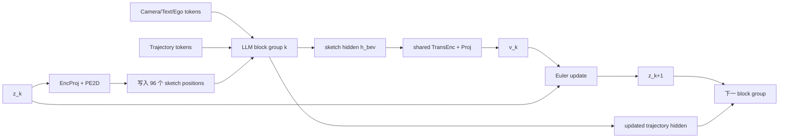

# X-Mind 训练与推理流程

> [!summary]
> 训练时，各 LLM block group 的 sketch positions 被替换成由同一个 GT future latent 构造的不同噪声级别；推理时没有 GT，必须将上一 block 预测的 velocity 通过 Euler update 变成下一 block 的 latent。这就是 block-to-block 的核心区别。

## 1. 统一符号

| 符号 | 含义 |
|---|---|
| $I^{1:7}$ | 七路当前摄像头图像 |
| $q$ | 文本、导航等 prompt |
| $s$ | 自车状态 |
| $B_{\mathrm{gt}}$ | 完整未来 12 帧 structured sketch |
| $z_1$ | DC-AE 编码出的 clean future latent，96 tokens |
| $z_0=\epsilon$ | Gaussian noise latent |
| $z_{t_k}$ | 第 $k$ 个 noise level 的 latent |
| $h_{\mathrm{bev}}^{(l)}$ | LLM 第 $l$ 层 sketch positions 的 hidden states |
| $v_k$ | 第 $k$ 个 block group 预测的 latent velocity |
| $H_{\mathrm{traj}}$ | trajectory token hidden states |
| $G_{\mathrm{plan}}$ | inverse-dynamics planning head |

## 2. 离线 GT 管线

```text
未来 12 个时刻的标注
  ├─ ego / surrounding agents
  ├─ lane topology / boundaries
  ├─ traffic-light states
  ├─ navigation corridor / arrows
  └─ speed / speed-limit margin / overspeed
                 ↓ rasterization
       B_gt: 12-frame sketch video
                 ↓ DC-AE encoder
       z_1: 96 continuous latent tokens
```

这里的 $z_1$ 同时编码 12 帧。论文没有公开其 temporal/spatial factorization。

## 3. 单个 Transformer block 内发生什么

设当前完整 token matrix 为：

$$
H^{(l)}=
[H_{\mathrm{text}};
H_{\mathrm{camera}};
H_{\mathrm{ego}};
H_{\mathrm{bev}};
H_{\mathrm{traj}}].
$$

标准 self-attention：

$$
Q=\operatorname{Norm}(H^{(l)})W_Q,
\quad
K=\operatorname{Norm}(H^{(l)})W_K,
\quad
V=\operatorname{Norm}(H^{(l)})W_V,
$$

$$
A=\operatorname{softmax}
\left(\frac{QK^\top}{\sqrt{d_k}}+M\right),
$$

$$
H^{(l+1)}
=H^{(l)}+AVW_O
+\operatorname{MLP}(\cdot).
$$

因此 BEV/sketch tokens 不是孤立去噪：它们会读取 camera、text 和 ego-state tokens；trajectory tokens 也会读取 BEV/sketch tokens。

## 4. 训练算法

时间表：

$$
[t_0,t_1,t_2,t_3,t_4,t_5]
=[0,0.1,0.2,0.4,0.7,1.0].
$$

每条样本：

```text
1. z_1 = DC-AE-Enc(B_gt)
2. epsilon ~ N(0, I)
3. v* = z_1 - epsilon
4. 编码 camera/text/ego/trajectory tokens
5. 对 k = 0...4：
   a. z_tk = (1-t_k) epsilon + t_k z_1
   b. 用 EncProj(z_tk)+PE2D 覆盖当前 block 边界的 sketch positions
   c. 运行第 k 个 LLM block group
   d. 取出 sketch hidden states h_bev^(l_k)
   e. v_k = shared_TransEnc(Proj(h_bev^(l_k)))
   f. 累积 ||v_k-v*||^2
6. 随机选择一个层 r，把对应 latent 解码为 sketch
7. 计算 MSE + LPIPS reconstruction loss
8. planning head 从未来条件化 hidden states 输出 acceleration/yaw rate
9. 计算 control L1 loss
10. 联合反向传播
```

### 4.1 为什么训练时要反复覆盖 sketch hidden states

如果直接把第一个 block 的错误输出滚到最后，训练初期深层 block 会看到严重偏离目标分布的输入，优化不稳定。GT interpolation 确保第 $k$ 个 block 总能学习指定 noise level 下的 velocity field。

代价是 exposure bias：推理时输入来自模型自身，而训练时来自正确 interpolation。

## 5. 推理算法

```text
1. 编码 camera/text/ego tokens
2. z_0 ~ N(0, I)
3. 初始化 96 个 sketch positions = EncProj(z_0)+PE2D
4. 对 k = 0...4：
   a. 运行第 k 个 LLM block group
   b. 取 sketch hidden states
   c. v_k = shared_TransEnc(Proj(h_bev^(l_k)))
   d. z_(k+1) = z_k + (t_(k+1)-t_k) v_k
   e. 将 EncProj(z_(k+1))+PE2D 送入下一 block group
5. 用 final trajectory hidden states 预测 acceleration/yaw rate
6. 用车辆运动学模型积分成轨迹
7. 可选：DC-AE-Dec(z_5) 输出可视化 sketch video
```

## 6. 从一个 block 到下一个 block



两条状态同时向深层传递：

1. $z_k\rightarrow z_{k+1}$：显式 future latent 的数值更新；
2. $H_{\mathrm{traj}}^{(k)}\rightarrow H_{\mathrm{traj}}^{(k+1)}$：trajectory token 在 self-attention 中累积未来信息。

## 7. 为什么是五次 denoising，却只需一次 LLM forward

普通 diffusion：

```text
完整 denoiser forward × 5
```

X-Mind：

```text
LLM layers 1...L1   → velocity 0
LLM layers L1...L2  → velocity 1
LLM layers L2...L3  → velocity 2
LLM layers L3...L4  → velocity 3
LLM layers L4...L5  → velocity 4
```

每一层本来就只会运行一次，X-Mind 在层组边界增加轻量共享 velocity head 和 Euler update。因此是一次 backbone traversal、五个内部 refinement stages。

## 8. Planner 究竟看到了什么

论文图示表明 trajectory tokens 与 sketch tokens 共处同一 Large Drive Model。因此 planner 的信息来源不是最终解码出来的图片，而是：

$$
H_{\mathrm{traj}}^{\mathrm{final}}
=F_\theta(I^{1:7},q,s,z_0;v_0,\ldots,v_4).
$$

可以理解为：

```text
future sketch latent = 显式“想象内容”
trajectory hidden     = 读取过想象内容后的决策状态
planner head          = 把决策状态翻译为车辆控制
```

## 9. 三个最容易混淆的问题

### Q1：$z^*=\operatorname{Enc}_{\mathrm{DC-AE}}(B_{\mathrm{GT}})$ 是一帧还是 12 帧？

是完整 12 帧序列的 clean latent target。论文把整段 rollout 统称为 $B_{\mathrm{GT}}$。

### Q2：$\operatorname{EncProj}(z_{t_k})+\operatorname{PE}_{2D}$ 如何进入下一层？

它直接覆盖当前层边界上 sketch token positions 的 hidden states。经过当前 block self-attention 后，提取其输出预测 $v_k$；推理时用 Euler 更新得到 $z_{k+1}$，重新投影后写入下一 block group。

### Q3：DC-AE decoder 是否先生成图片，再把图片送给 planner？

高效主路径不需要这样做。Planner 使用共享 LLM 中的 latent/hidden states；decoder 用于 sketch reconstruction loss 和可视化。如果真的先解码图片再重编码，论文宣称的低延迟优势会被削弱。

## 10. 可复现性缺口

- Large Drive Model 的具体 backbone、层数和 block 划分未公开；
- token 顺序和 attention mask 未完整说明；
- 96-token latent 的 exact shape 未公开；
- `EncProj`、`Proj`、shared `TransEnc` 的宽度和层数未公开；
- DC-AE architecture 和预训练配置未公开；
- planner head 和 kinematic integration 的具体公式未公开；
- 时间采样间隔、12 帧完整 horizon 未明确给出；
- loss 权重 $\lambda$ 未报告；
- 绝对端到端延迟和硬件配置未报告。

返回主笔记：[[X-Mind 深度解读]]。

