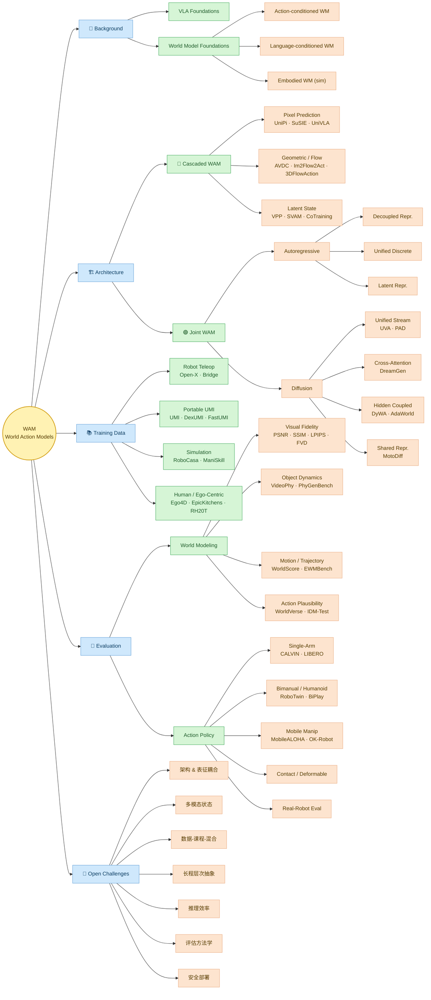
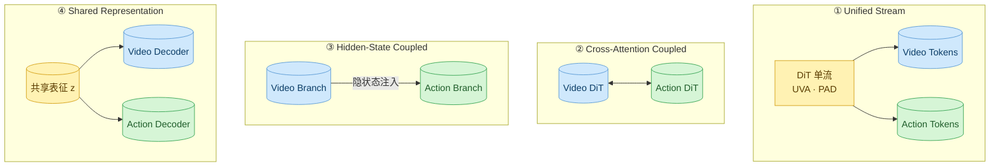

# 🌳 WAM 分类树（Taxonomy）

> 综述 Fig.2 的精简可视化版：六大维度 × 代表方法。

---

## 1. 全景分类树

---

## 2. Joint WAM 内部 4 种耦合方式（Diffusion 派）

---

## 3. 选型速查表

| 你的需求 | 推荐路线 | 代表工作 |
|---|---|---|
| 解释性强、可视化未来 | Cascaded · Pixel | UniPi, SuSIE |
| 几何/接触敏感 | Cascaded · Flow | AVDC, Im2Flow2Act |
| 训练-推理一致、低延迟 | Joint · AR | GR-1, UVA |
| 高保真、多模态 | Joint · Diffusion | DreamGen, DyWA |
| 大规模人类视频预训练 | Cascaded · Latent | VPP, OneVLA |

---

**返回**：[[WAM综述概览.md]]
