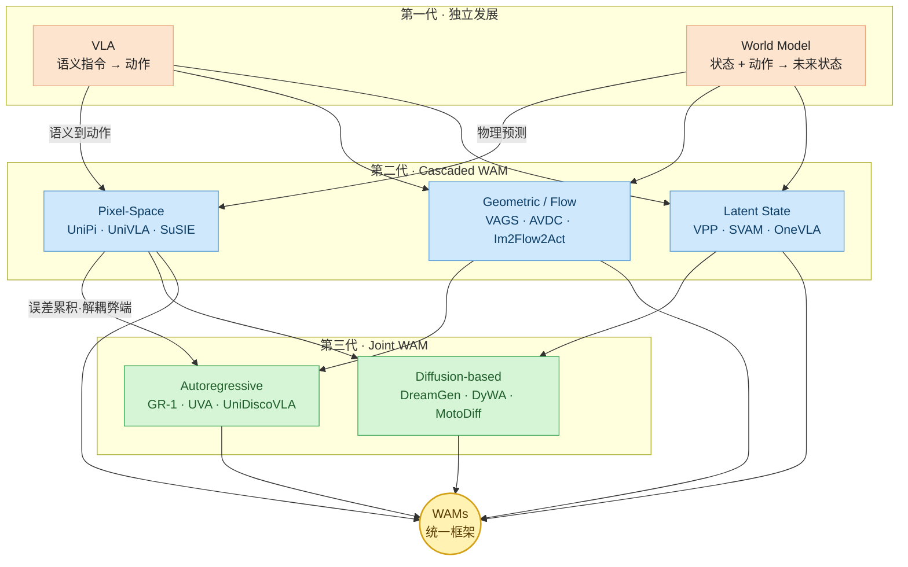
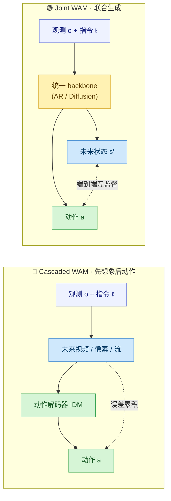
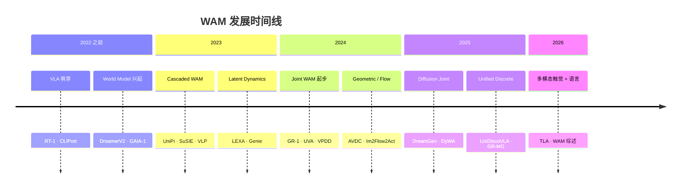

# 🧬 WAM 架构演化图

> 从 VLA 与 World Model 两条独立路线，到 Cascaded WAM，再到 Joint WAM 的演化全景。

---

## 1. 三代演化路线图

```mermaid
flowchart TB
    classDef old fill:#fde4cf,stroke:#e8a87c,color:#222,stroke-width:1px
    classDef cas fill:#cfe8fc,stroke:#5b9bd5,color:#0b3d66,stroke-width:1px
    classDef joint fill:#d6f5d6,stroke:#3aa655,color:#1f5d2a,stroke-width:1px
    classDef wam fill:#fff2b3,stroke:#d4a017,color:#5a3c00,stroke-width:2px

    subgraph G1[" 第一代 · 独立发展 "]
        VLA["VLA<br/>语义指令 → 动作"]:::old
        WM["World Model<br/>状态 + 动作 → 未来状态"]:::old
    end

    subgraph G2[" 第二代 · Cascaded WAM "]
        direction TB
        C1["Pixel-Space<br/>UniPi · UniVLA · SuSIE"]:::cas
        C2["Geometric / Flow<br/>VAGS · AVDC · Im2Flow2Act"]:::cas
        C3["Latent State<br/>VPP · SVAM · OneVLA"]:::cas
    end

    subgraph G3[" 第三代 · Joint WAM "]
        direction TB
        J1["Autoregressive<br/>GR-1 · UVA · UniDiscoVLA"]:::joint
        J2["Diffusion-based<br/>DreamGen · DyWA · MotoDiff"]:::joint
    end

    WAMHUB(("WAMs<br/>统一框架")):::wam

    VLA -- 语义到动作 --> C1
    WM  -- 物理预测 --> C1
    VLA --> C2
    WM  --> C2
    VLA --> C3
    WM  --> C3

    C1 -- 误差累积·解耦弊端 --> J1
    C2 --> J1
    C3 --> J2
    C1 --> J2

    J1 --> WAMHUB
    J2 --> WAMHUB
    C1 --> WAMHUB
    C2 --> WAMHUB
    C3 --> WAMHUB
```

---

## 2. Cascaded vs Joint：一眼对比

```mermaid
flowchart LR
    classDef obs fill:#eef2ff,stroke:#6c7bd6,color:#1a237e
    classDef wm  fill:#cfe8fc,stroke:#5b9bd5,color:#0b3d66
    classDef act fill:#d6f5d6,stroke:#3aa655,color:#1f5d2a
    classDef bad fill:#ffd6d6,stroke:#cc3333,color:#660000
    classDef good fill:#fff2b3,stroke:#d4a017,color:#5a3c00

    subgraph CAS[" 🔵 Cascaded WAM · 先想象后动作 "]
        O1["观测 o + 指令 ℓ"]:::obs --> P1["未来视频 / 像素 / 流"]:::wm
        P1 --> D1["动作解码器 IDM"]:::act
        D1 --> A1["动作 a"]:::act
        P1 -. 误差累积 .-> A1
    end

    subgraph JNT[" 🟢 Joint WAM · 联合生成 "]
        O2["观测 o + 指令 ℓ"]:::obs --> U["统一 backbone<br/>(AR / Diffusion)"]:::good
        U --> S2["未来状态 s'"]:::wm
        U --> A2["动作 a"]:::act
        S2 <-. 端到端互监督 .-> A2
    end
```

---

## 3. 时间线（参考综述 Fig.1）

```mermaid
timeline
    title WAM 发展时间线
    section 2022 之前
        VLA 萌芽 : RT-1 · CLIPort
        World Model 兴起 : DreamerV2 · GAIA-1
    section 2023
        Cascaded WAM : UniPi · SuSIE · VLP
        Latent Dynamics : LEXA · Genie
    section 2024
        Joint WAM 起步 : GR-1 · UVA · VPDD
        Geometric / Flow : AVDC · Im2Flow2Act
    section 2025
        Diffusion Joint : DreamGen · DyWA
        Unified Discrete : UniDiscoVLA · GR-MG
    section 2026
        多模态触觉 + 语言 : TLA · WAM 综述
```

---

**返回**：[[WAM综述概览.md]]
