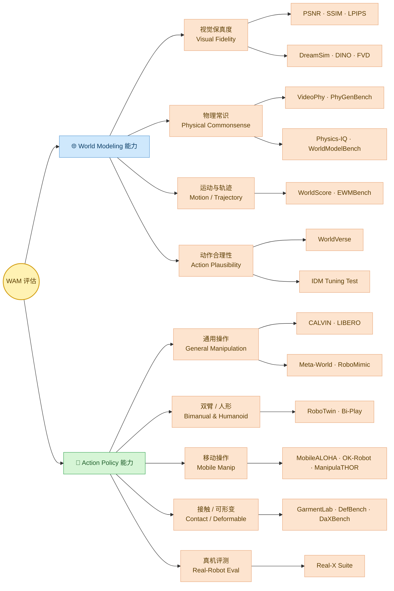
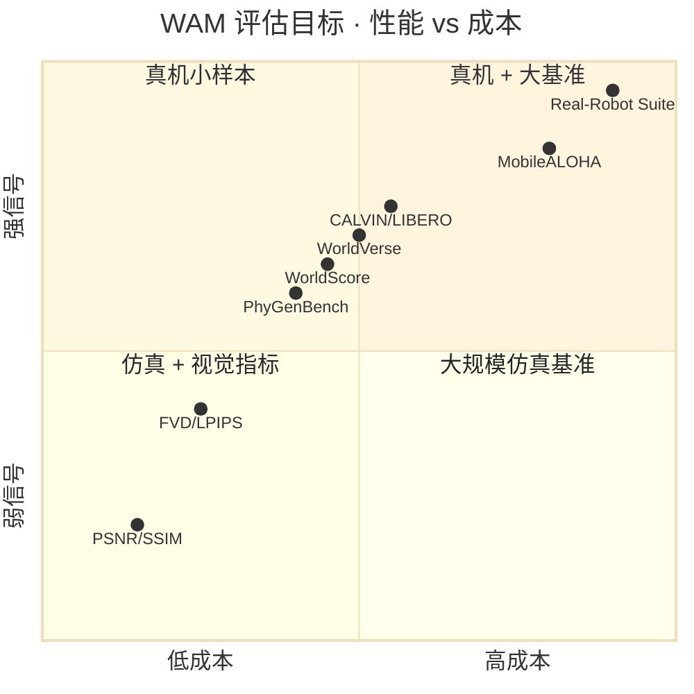
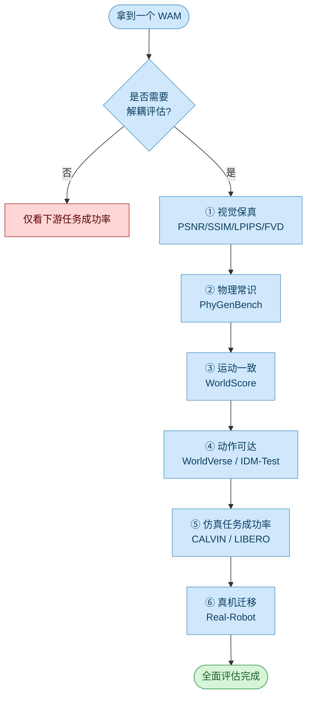

# 📏 WAM 评估体系图

> WAM 的双重身份决定了它有**两套独立又交织**的评估维度：World Modeling（"想得对不对"）+ Action Policy（"做得好不好"）。

---

## 1. 两轴评估全景

---

## 2. 评估雷达图（示意 · 一目了然）

---

## 3. 评估流程速查

---

## 4. 三个常见误区

| 误区 | 真相 |
|---|---|
| 视觉指标好 = 策略好 | ❌ FVD 高 ≠ 动作可达，需补 IDM-Test |
| 仿真成功率 = 真机成功率 | ❌ Sim2Real 差距常见，必做真机抽样 |
| 单一基准跑分 | ❌ 应交叉跑 fidelity + dynamics + policy |

---

**返回**：[[WAM综述概览.md]]
