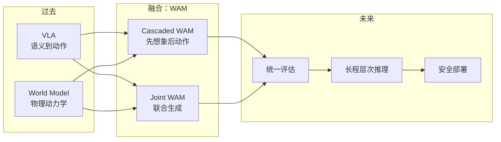

# 🌐 WAM 综述概览：World Action Models

> 一句话定位：**WAM = 把"世界模型 (WM)"的物理预测能力 与 "VLA"的指令到动作映射能力 统一起来，让具身智能体既能"想象未来"，又能"决定现在做什么"。**

相关图示：[[WAM综述-架构演化图.md]] · [[WAM综述-分类树.md]] · [[WAM综述-评估体系图.md]]

---

## 1. 为什么需要 WAM（动机）

VLA 已经在多任务、多本体上展现了**语义泛化**能力，但在长程、动态、接触丰富的真实环境里仍有三类天花板：

- ❌ **缺世界先验**：直接从观测映射动作，不显式建模物理因果，遇到未见过的扰动就崩。
- ❌ **样本&扩展受限**：依赖大规模演示数据，零样本能力差。
- ❌ **视觉时空理解弱**：对长时序动力学、遮挡、接触缺乏建模。

WM 端则能预测未来视觉/状态、有强物理先验，但**没有动作输出**，无法直接驱动机器人。

> WAM 把两者并入一个统一概率框架，对 **未来状态 s' 与动作 a** 联合建模：
>
> $\mathcal{L}_{\text{WAM}} = \mathbb{E}_{(s,c,s',a)}\big[-\log p_\theta(s', a \mid s, c)\big]$

---

## 2. WAM 的形式化定义

| 概念 | 输入 | 输出 | 优化目标 |
|---|---|---|---|
| **VLA** | 观测 o + 指令 ℓ | 动作 a | $p(a\mid o,\ell)$ |
| **WM** | 状态 s + 干预 a | 下一状态 s' | $p(s'\mid s,a)$ |
| **WAM** | 观测 o + 指令 ℓ | **未来状态 s' + 动作 a** | $p(s', a\mid o, \ell)$ |

两个核心能力：
1. **Forward Predictive Modeling**：在显式或隐式的潜空间中演化未来。
2. **Coupled Action Generation**：基于预测出的（或共同推断的）未来生成策略动作。

🔑 与近邻概念的辨析：
- **Video Action Model**：仅做"视频+动作"联合预测，是 WAM 的子集。
- **Video Policy**：把视频生成当作 action proxy，**不显式给出动作**。
- **Action World Model**：术语颠倒，WAM 强调"World Model"为主语。

---

## 3. WAM 的两条架构路线

> 见 [[WAM综述-架构演化图.md]]

### 3.1 Cascaded WAM（级联式：先想象，再行动）
**Pipeline**：观测 → 预测未来视觉/像素/光流/几何 → 解码为动作。

- **Pixel-Space Prediction**：UniPi、UniVLA、SuSIE、VLP …
- **Geometric / Flow Prediction**：VAGS、AVDC、AVDC、Im2Flow2Act、AnimateDiff …
- **Latent State Prediction**：VPP、SVAM、Video Policy、Co-training、OneVLA …

✅ 优点：解释性强，未来轨迹可视；可借力大规模视频预训练。
❌ 缺点：两阶段误差累积，pixel 级预测算力高且与控制目标错位。

### 3.2 Joint WAM（联合式：同步预测状态与动作）
**Pipeline**：状态与动作 在同一统一 backbone 中联合采样/解码。

- **Autoregressive Generation** (GR-1/GR-2、UVA、VPDD、VLA-RPA、UniDiscoVLA …)
  - Decoupled Representation
  - Unified Discrete Representation
  - Latent Representation
- **Diffusion-based Generation**
  - Unified Stream（UVA、PAD、VideoVLA …）
  - Cross-Attention Coupled（DreamGen、HaloDiff …）
  - Hidden-State Coupled（DyWA、AdaWorld、RoboDual …）
  - Shared Representation（MotoDiff、AnyDual …）

✅ 优点：紧耦合、避免误差累积、训练-推理一致。
❌ 缺点：动作-视觉模态/频率不匹配，长程预测计算开销大。

> 详见 [[WAM综述-分类树.md]]

---

## 4. 训练数据：WAM 的"四级火箭"

| 层级 | 代表数据 | 量级 | 作用 |
|---|---|---|---|
| **L1 Robot-Centric Teleop** | Open-X-Embodiment, Bridge, RT-1 | 万级轨迹 | 高保真动作监督 |
| **L2 Portable UMI 类演示** | UMI, DexUMI, FastUMI, RealDex | 100~1000h | 低成本扩规模 |
| **L3 Simulation** | RoboCasa, ManiSkill, LIBERO, RoboCAS | 百万级 | 程序化合成、可控扰动 |
| **L4 Human / Ego-Centric** | Ego4D, EpicKitchens, RH20T, AgiBot | 千万 ~ 亿小时 | 物理常识 & 视觉动力学 |

🎯 **数据 takeaway**：WAM 不再依赖单一数据源，呈现"小而精的机器人数据 + 大而广的人类视频"双轮驱动。

---

## 5. 评估：从"像不像"到"对不对"

> 见 [[WAM综述-评估体系图.md]]

### 5.1 World Modeling（世界模拟质量）
| 维度 | 代表指标 |
|---|---|
| Visual Fidelity | PSNR / SSIM / LPIPS / DreamSim / DINO / FVD |
| Object Dynamics | VideoPhy, PhyGenBench, Physics-IQ |
| Motion / Trajectory | WorldScore, EWMBench |
| **Action Plausibility** | WorldVerse, IDM Tuning Test |

### 5.2 Action Policy（策略性能）
- 单臂操作：CALVIN, LIBERO, RoboMimic, Meta-World
- 双臂/人形：RoboTwin, BiPlay, Bimanual-Suite
- 移动操作：MobileALOHA, OK-Robot, HomeRobot
- 接触/可形变：Garmentlab, DefBench, DaXBench
- 真机评测：Real-Robot suite, AGiBot Real

---

## 6. 七大开放挑战

| # | 挑战 | 关键问题 |
|---|---|---|
| 1 | **架构耦合** | 如何让 WM 与 Action 头互相约束而非互拖累？ |
| 2 | **多模态状态表征** | 像素 / 几何 / 力 / 触觉 …如何统一编码？ |
| 3 | **数据利用 & 课程混合** | 人类视频 → 机器人动作的迁移机制 |
| 4 | **长程规划 & 时序抽象** | 分层 WAM、子目标、时间抽象 |
| 5 | **推理延迟 / 计算效率** | 像素级预测算力难落地；蒸馏与潜空间路线 |
| 6 | **评估方法学** | 解耦 World Modeling / Action 的双重评测 |
| 7 | **安全可靠部署** | 想象漂移、不确定性量化、可回退控制 |

---

## 7. 一图看懂的"WAM 全景"

---

## 8. 阅读路径建议（参照 [[如何高效阅读综述论文]]）

| 角色 | 推荐先读 | 重点 |
|---|---|---|
| 🟢 初学者 | §1-2, §3 概念图, §7 | 概念 + 分类 + 未来 |
| 🟡 研究者 | §3.2 Joint WAM, §4, §6, §7 | 架构细节 + 开放问题 |
| 🟠 从业者 | §4 数据集表, §5 Benchmarks | 数据/Benchmark 选型 |

---

## 9. 三句话总结

1. **WAM 是 VLA 与 World Model 的"必然合流"**：把动作生成与未来预测放进同一个概率框架。
2. **路线分为 Cascaded（先想象后行动）和 Joint（联合解码）两大谱系**，后者再细分为 AR / Diffusion 等多种耦合方式。
3. **数据-架构-评估 三位一体的瓶颈仍未解开**，是未来 1~3 年具身智能最值得投入的前沿。

---

**最后更新**：2026-06-04
**对应 PDF**：[[Wang 等 - 2026 - World Action Models The Next Frontier in Embodied AI.pdf]]
